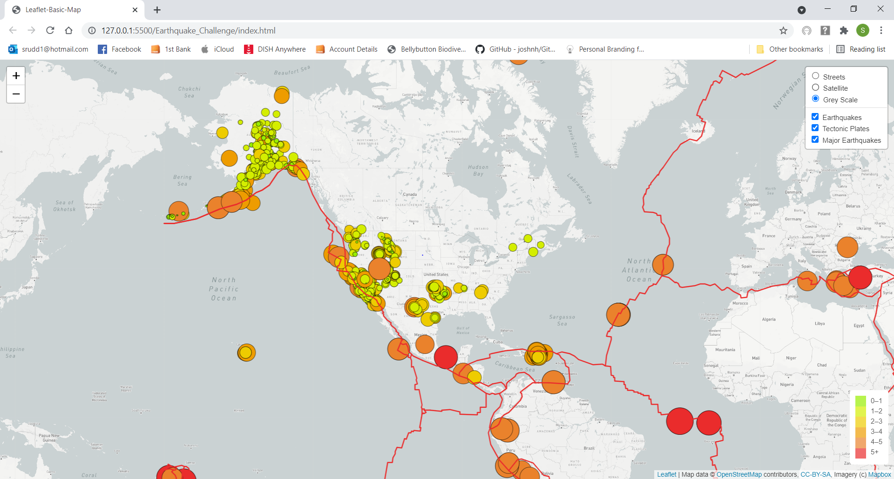
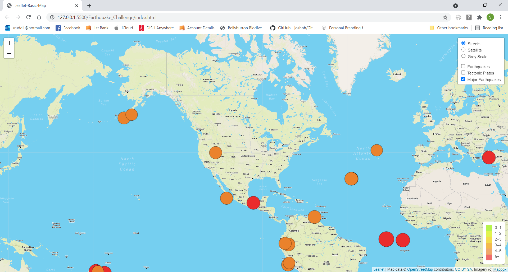
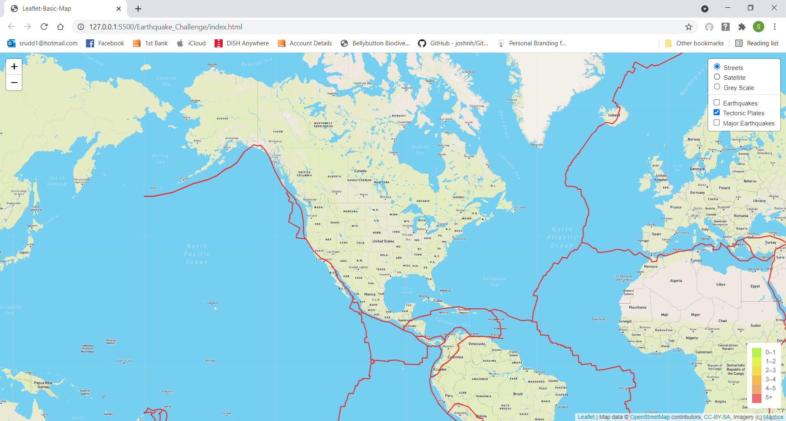

# Mapping Earthquakes
## Purpose
For this challenge and lesson, we learned how to build maps for websites using Leaflet, d3, JavaScript and web scraping.  The map is interactive where you can see the following:
* Three different versions of the map
    * streets
    * satellite
    * grey scale
* Visualization for the size of the earthquakes in both color and size of the marker
* A legend for the magnitude of the earthquakes
* Three different options for mapping earthquakes
    * All earthquakes with their magnitude

    

    * All major earthquakes over a 4.5 magnitude
    

    * Tectonic plates
    

## Results
The challenge required the addition of a third version of the map,  the major earthquakes, and the tectonic plates.  These additions  were relatively easy as it was just a copy and refactoring the code.
